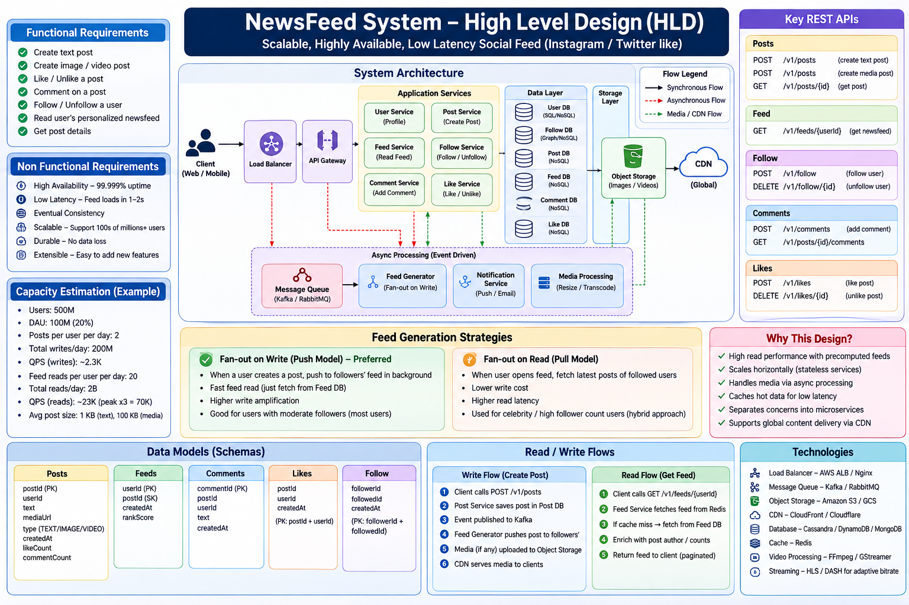

## Functional Requirements
- Create Text Post
- Create Image/Video Post
- Read News Feed (Timeline)
- Follow / Unfollow
- Like Post
- Comment on Post
- User Notification

## Non Functional Requirements
- High Availability (99.99%)
- Eventual Consistency
- 1-2 sec feed latency
- Global scalability
- Extensibility
- Fast rendering

## APIs
- POST /v1/posts
- POST /v1/comments
- POST /v1/follow
- GET /v1/feeds/{userId}

## Core Services
- API Gateway
- Post Writer Service
- Feed Reader Service
- Feed Generator Service
- Follow Service
- Like Service
- Comment Service
- Notification Service
- Presigned URL Generator
- Media Processing Service

## Databases
| Component | Storage |
|---|---|
| Posts | Posts DB |
| Feed | Feeds DB |
| Follow Graph | Graph DB |
| Likes | Likes DB + Likes Cache |
| Comments | Comments DB |
| Feed Cache | Redis |
| Media | Object Storage + CDN |

## Write Flow
Client -> API Gateway -> Post Writer -> Posts DB
                             -> Message Queue
                             -> Feed Generator
                                   -> Follow DB
                                   -> Feeds DB
                                   -> Feeds Cache

## Read Flow
Client -> Feed Reader
             -> Feeds Cache
             -> Feeds DB
             -> Likes Cache
             -> Likes DB
Client -> CDN -> Object Storage

## Comment Flow
Client -> API Gateway -> Comment Service
        -> Comments DB
        -> Queue
        -> Notification Service

## Like Flow
Client -> API Gateway -> Like Service
        -> Likes DB
        -> Likes Cache
        -> Queue
        -> Notification Service

## Data Models
Posts(postId,userId,text,mediaUrls,timestamp)
Feed(userId,feedItems[])
Comments(commentId,userId,postId,comment,timestamp)
Likes(likeId,userId,postId,timestamp)
Follow(userId,followers[],followees[])

## Interview keywords
Kafka, Redis, CDN, Object Storage, Graph DB, Fan-out on Write, Fan-out on Read, Eventual Consistency, Cursor Pagination, Sharding, Replication
