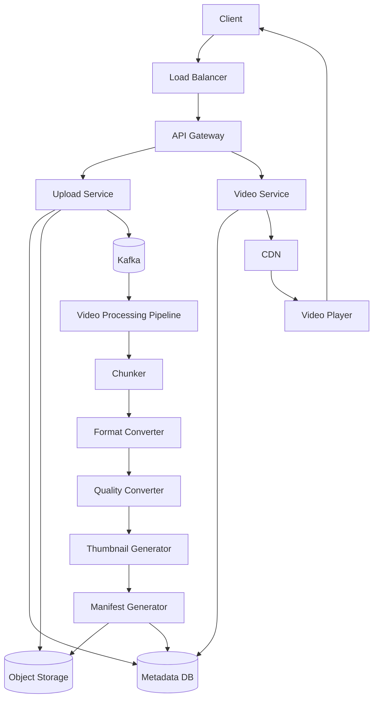
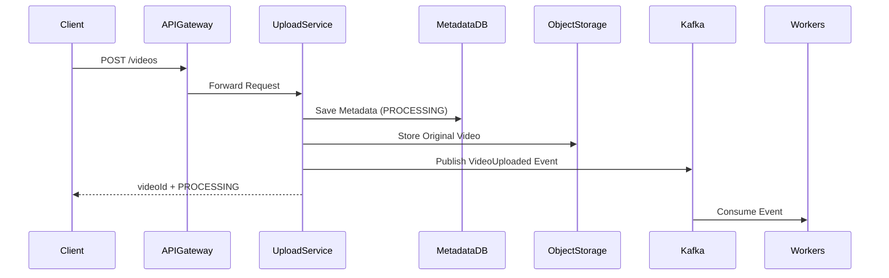
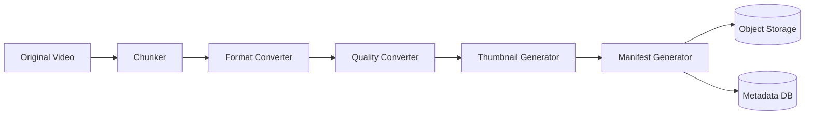
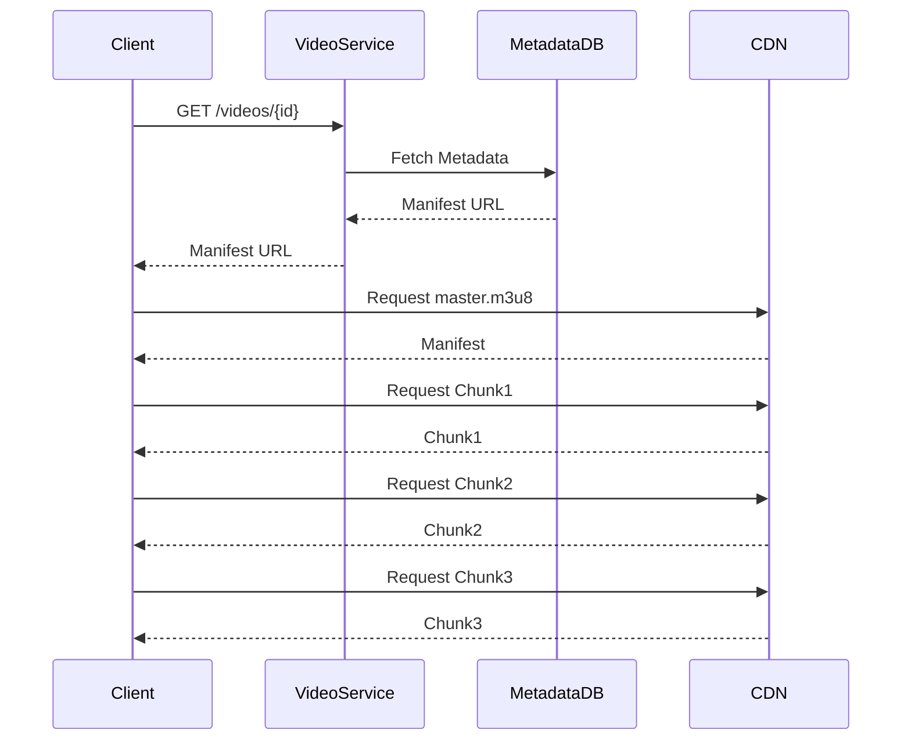
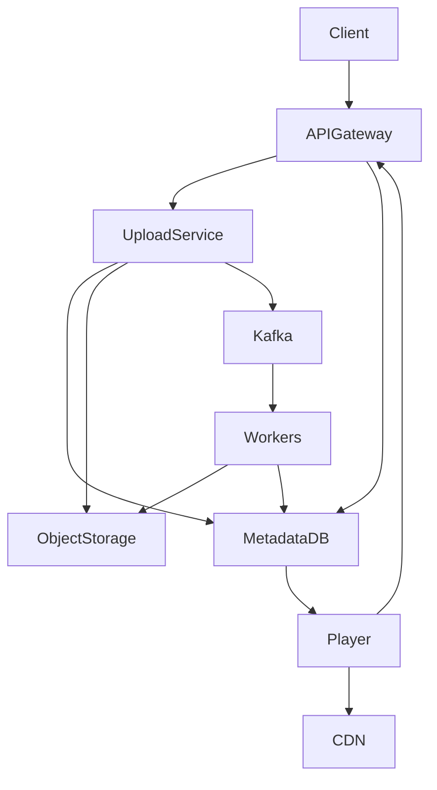

# YouTube High Level Design (HLD)

> This document contains interview notes for designing YouTube from scratch.
>
> **Scope**
>
> - Upload Videos
> - View / Stream Videos
>
> Other features such as comments, likes, recommendations, subscriptions, notifications and monetization are considered out of scope.

---

# 1. Functional Requirements

## 1. Upload Video

The system should allow users to upload videos.

During upload,

- Validate request
- Store video
- Store metadata
- Process video in background
- Generate multiple resolutions
- Generate thumbnails
- Generate streaming manifest

---

## 2. Stream Video

Users should be able to

- Watch videos
- Seek videos
- Resume playback
- Automatically switch quality depending upon internet speed
- Stream videos with very low latency

---

# 2. Non Functional Requirements

## High Availability

Users should be able to upload/watch videos even if few servers fail.

---

## Scalability

Millions of uploads and viewers should be supported.

The system should scale horizontally.

---

## Low Latency

Playback should start within a few seconds.

---

## Fault Tolerance

If one processing server crashes,

another worker should continue processing.

---

## Durability

Videos should never be lost.

Object Storage should replicate data.

---

# 3. Capacity Estimation

Since exact numbers are unavailable, let's make assumptions.

## Assumptions

| Metric | Value |
|---------|------|
| Daily Active Users | 100 Million |
| Uploads/day | 10 Million |
| Videos watched/user/day | 5 |
| Average Video Size | 100 MB |

---

## Upload Traffic

```
10 Million uploads/day

10,000,000 / 86400

≈116 uploads/sec

Peak ≈300 uploads/sec
```

---

## Streaming Traffic

```
100M users

×

5 videos/day

=

500 Million Views/day
```

```
500M / 86400

≈5800 requests/sec

Peak ≈25000 requests/sec
```

Observation

Read traffic is significantly higher than write traffic.

Hence YouTube is a **Read Heavy System**.

---

## Storage

Average Video

```
100 MB
```

Daily

```
10M ×100 MB

=

1 PB/day
```

Yearly

```
≈365 PB
```

A relational database cannot store this amount of binary data.

Hence we need Object Storage.

---

## Metadata

Metadata per video

```
≈2 KB
```

Daily metadata

```
10M ×2 KB

≈20 GB/day
```

Metadata is tiny compared to video storage.

Hence it can easily be stored inside a database.

---

# 4. API Design

## Upload Video

```
POST /videos
```

### Request

```json
{
    "title":"System Design",
    "description":"YouTube HLD",
    "file":"video.mp4"
}
```

> In production, the file is generally sent as **multipart/form-data** or uploaded directly to Object Storage using a pre-signed URL.

### Response

```json
{
   "videoId":"12345",
   "status":"PROCESSING"
}
```

Why PROCESSING?

Because uploading finishes quickly but transcoding can take several minutes.

The client should not wait.

---

## Get Video

```
GET /videos/{videoId}
```

Response

```json
{
   "videoId":"12345",
   "title":"System Design",
   "status":"READY",
   "duration":620,
   "thumbnailUrl":"...",
   "streamUrl":"https://cdn.youtube.com/master.m3u8"
}
```

Notice

We do NOT return the video.

Instead,

we return

```
Manifest URL
```

The player downloads video chunks directly from CDN.

---

# 5. High Level Architecture



---

# 6. Component Explanation

## Client

Represents

- Web Browser
- Android App
- iOS App
- Smart TV

Responsibilities

- Upload videos
- Stream videos

---

## Load Balancer

Distributes traffic across multiple API servers.

Benefits

- High Availability
- Scalability
- No Single Point of Failure

---

## API Gateway

Responsible for

- Authentication
- Authorization
- Routing
- Rate Limiting
- Logging

Every request enters through the API Gateway.

---

## Upload Service

Responsible for

- Validate upload
- Generate Video ID
- Save metadata
- Store original video
- Publish upload event

It **does not** perform transcoding.

Heavy processing happens asynchronously.

---

## Video Service

Provides

- Video metadata
- Manifest URL
- Thumbnail URL
- Video Status

It never streams video itself.

Instead,

it returns the CDN URL.

---

## Metadata Database

Stores

- Video ID
- Title
- Description
- Owner
- Upload Time
- Status
- Duration
- Manifest URL
- Thumbnail URL

Actual videos are **never stored here**.

---

## Object Storage

Stores

- Original Video
- Processed Videos
- Chunks
- Thumbnails

Examples

- Amazon S3
- Azure Blob Storage
- Google Cloud Storage

---

## Kafka

Purpose

Decouple Upload from Processing.

Without Kafka

```
Upload

↓

Transcoding

↓

Client waits
```

With Kafka

```
Upload

↓

Kafka

↓

Workers

↓

Client receives response immediately
```

---

## Video Processing Pipeline

Contains

- Chunker
- Format Converter
- Quality Converter
- Thumbnail Generator
- Manifest Generator

These workers consume Kafka events.

---

## CDN

Stores processed video chunks closer to users.

Instead of

```
India User

↓

US Server
```

Requests become

```
India User

↓

Nearest Edge Server
```

This significantly reduces latency.

---

# 7. Why This Architecture?

| Component | Reason |
|------------|--------|
| API Gateway | Authentication, Routing, Rate Limiting |
| Upload Service | Accept uploads and metadata |
| Metadata DB | Store video information |
| Object Storage | Store large binary files |
| Kafka | Asynchronous processing |
| Chunker | Enable adaptive streaming |
| Format Converter | Support multiple devices |
| Quality Converter | Support multiple resolutions |
| CDN | Low latency global streaming |

---

# Part 2 - Upload Flow, Streaming Flow & Video Processing Pipeline

---

# 8. Video Upload Flow

Once the client uploads a video, the upload should finish quickly.

Heavy processing like transcoding, chunking, thumbnail generation etc. should happen asynchronously.

The high-level flow is shown below.



---

## Step 1

Client uploads video.

```
POST /videos
```

The upload request contains

- Video
- Title
- Description

---

## Step 2

API Gateway authenticates the request.

Responsibilities

- Authentication
- Authorization
- Rate Limiting
- Routing

---

## Step 3

Upload Service

The upload service performs only lightweight operations.

It

- Generates Video ID
- Saves metadata
- Uploads original file

Metadata status

```
PROCESSING
```

The Upload Service **does not** perform transcoding.

---

## Step 4

Store Original Video

The original uploaded video is stored inside Object Storage.

Examples

- Amazon S3
- Google Cloud Storage
- Azure Blob

Reason

Object Storage

- Cheap
- Durable
- Highly Scalable

---

## Step 5

Publish Kafka Event

```
VideoUploaded
```

Example Event

```json
{
    "videoId":"12345",
    "storagePath":"videos/original/video.mp4"
}
```

Why Kafka?

Without Kafka

```
Upload

↓

Transcoding

↓

Client waits

↓

Poor UX
```

With Kafka

```
Upload

↓

Kafka

↓

Background Workers

↓

Immediate Response
```

---

# 9. Video Processing Pipeline

Once Kafka receives an event,

background workers begin processing.



---

# 10. Chunker

Chunker splits large videos into small segments.

Example

```
Movie.mp4

↓

chunk1.ts

chunk2.ts

chunk3.ts

chunk4.ts
```

Typical chunk duration

```
5-10 seconds
```

---

## Why Chunking?

### 1 Faster Seeking

User jumps to

```
10:32
```

Instead of downloading the entire movie,

Player downloads only the required chunk.

---

### 2 Retry

Suppose

Chunk 15 fails.

Only

```
Chunk15
```

is downloaded again.

Entire video isn't restarted.

---

### 3 Adaptive Bitrate

Player can switch

```
720p

↓

480p

↓

240p
```

between chunks.

Impossible with one huge file.

---

# 11. Format Converter

Different browsers support different codecs.

The Format Converter generates multiple formats.

```
MP4

MOV

WebM
```

Examples

Safari

↓

MOV

Chrome

↓

WebM

Android

↓

MP4

---

# 12. Quality Converter

Generates different resolutions.

```
240p

360p

480p

720p

1080p

4K
```

Why?

Different internet speeds.

---

Suppose

Network becomes slow.

Player automatically switches

```
1080p

↓

720p

↓

480p
```

without stopping playback.

This is called

```
Adaptive Bitrate Streaming
```

---

# 13. Thumbnail Generator

Extracts preview images.

Used for

- Search Results
- Home Feed
- Recommendations

Usually

Several thumbnails are generated.

---

# 14. Manifest Generator

Manifest File

Example

```
master.m3u8
```

Contains

```
240p

480p

720p

1080p
```

and

their chunk locations.

Example

```
720p/chunk1.ts

720p/chunk2.ts

720p/chunk3.ts
```

Player downloads the Manifest first.

Then

downloads chunks.

---

# 15. Update Metadata

Once processing finishes,

Metadata DB is updated.

Status

```
READY
```

New Metadata

- Manifest URL
- Thumbnail URL
- Duration
- Chunk Location

Now

video becomes available for streaming.

---

# 16. Streaming Flow



---

# 17. Streaming Flow Explanation

### Step 1

Client requests

```
GET /videos/{videoId}
```

---

### Step 2

Video Service

returns

```
Manifest URL
```

instead of video.

---

### Step 3

Player downloads

```
master.m3u8
```

---

### Step 4

Manifest contains

- Available qualities
- Chunk URLs

---

### Step 5

Player selects quality.

Example

Good Network

```
1080p
```

Poor Network

```
360p
```

---

### Step 6

Player requests chunks.

```
Chunk1

↓

Chunk2

↓

Chunk3
```

Only

small chunks are downloaded.

---

### Step 7

If bandwidth changes,

Player switches

```
720p

↓

480p

↓

240p
```

without interrupting playback.

---

# 18. Why CDN?

Without CDN

```
India User

↓

US Server

↓

High Latency
```

With CDN

```
India User

↓

Nearest Edge Server

↓

20-30 ms
```

Advantages

- Lower Latency
- Reduced Origin Load
- Higher Availability
- Better User Experience

---

# 19. End-to-End Request Flow



---

# Part 3 - Database Design, Scaling, Trade-offs & Interview Questions

---

# 20. Database Design

## Metadata Database

The database stores only video metadata.

The actual video is stored in Object Storage.

---

### Video Table

| Column | Description |
|---------|-------------|
| videoId | Unique video identifier |
| title | Video title |
| description | Video description |
| creatorId | Uploader ID |
| duration | Video duration |
| uploadTime | Upload timestamp |
| status | PROCESSING / READY / FAILED |
| thumbnailUrl | Thumbnail location |
| manifestUrl | HLS/DASH Manifest URL |
| originalVideoPath | Original object storage path |

---

### Why don't we store videos inside the database?

Videos can be several GBs in size.

Databases are optimized for structured data, not huge binary files.

Advantages of Object Storage:

- Cheap
- Highly Durable
- Infinite Scalability
- Replication
- Lifecycle Policies

---

### Suggested Indexes

```
PRIMARY KEY (videoId)

INDEX (creatorId)

INDEX (status)

INDEX (uploadTime)
```

---

# 21. Scalability

## Horizontal Scaling

Every service should be stateless.

```
                Load Balancer

          /          |          \

Upload Service  Upload Service  Upload Service
```

When traffic increases

Simply add more servers.

---

## Kafka Scaling

Kafka partitions allow multiple workers.

```
             Kafka

      /        |        \

 Worker1   Worker2   Worker3
```

Each worker processes different videos.

---

## Object Storage Scaling

Object Storage scales automatically.

Examples

- Amazon S3
- Google Cloud Storage
- Azure Blob Storage

No manual sharding required.

---

## CDN Scaling

Instead of

```
India User

↓

US Origin
```

Use

```
India User

↓

India Edge Server
```

Benefits

- Lower latency
- Reduced origin traffic
- Better user experience

---

# 22. Caching

The application does not need to query Metadata DB every time.

Popular metadata can be cached.

```
Video Service

↓

Redis

↓

Metadata DB
```

Example

Frequently accessed

- Title
- Thumbnail
- Manifest URL

can be served from Redis.

---

# 23. Fault Tolerance

## Upload Service Failure

If Upload Service crashes

Request can be retried.

Object Storage is durable.

---

## Worker Failure

Suppose

```
Worker crashes
```

Kafka does not acknowledge the message.

Another worker consumes the same event.

No video is lost.

---

## Object Storage Failure

Use replication across multiple Availability Zones.

Example

```
S3

↓

AZ1

AZ2

AZ3
```

---

## CDN Failure

If one edge server fails,

another edge server serves the content.

---

# 24. Bottlenecks

## Problem 1

Millions of users upload videos simultaneously.

Solution

```
Kafka

↓

Queue

↓

Background Workers
```

---

## Problem 2

One video becomes viral.

```
100 Million Views
```

Solution

```
CDN

↓

Edge Cache
```

Application servers are bypassed.

---

## Problem 3

Metadata Database becomes overloaded.

Solution

```
Redis Cache

↓

Metadata DB
```

---

## Problem 4

Large video upload interrupts.

Solution

Use

```
Resumable Uploads
```

Only remaining bytes are uploaded.

---

# 25. Trade-offs

| Decision | Why? | Alternative |
|-----------|------|-------------|
| Object Storage | Cheap binary storage | HDFS |
| Kafka | Decouple upload & processing | RabbitMQ |
| CDN | Global low latency | Origin only |
| Metadata DB | Structured metadata | NoSQL |
| Chunking | Adaptive streaming | Entire video |

---

# 26. Common Interview Questions

---

## Why Kafka?

Uploading should finish immediately.

Transcoding takes time.

Kafka allows asynchronous processing.

---

## Why not RabbitMQ?

RabbitMQ is excellent for task queues.

Kafka is preferred for

- High Throughput
- Event Streaming
- Replay Capability

---

## Why Object Storage?

Object Storage provides

- Durability
- Cheap storage
- Virtually unlimited capacity

Databases are not designed for multi-GB files.

---

## Why Chunk Videos?

Chunking allows

- Adaptive Bitrate Streaming
- Fast Seeking
- Retry failed chunks only

---

## Why Manifest File?

Manifest tells the player

- Available qualities
- Chunk locations

Without it

Player doesn't know what to download.

---

## Why CDN?

CDN stores chunks near users.

Result

- Low Latency
- Faster Startup
- Reduced Origin Load

---

## What if transcoding fails?

Update metadata

```
FAILED
```

Retry processing later.

---

## What if worker crashes?

Kafka message remains unacknowledged.

Another worker retries.

---

## What if user uploads 10GB video?

Use

```
Pre-Signed URL

+

Multipart Upload

+

Resumable Upload
```

---

## Why not return video from Video Service?

Application servers should not stream GB-sized videos.

Return only

```
Manifest URL
```

Client streams directly from CDN.

---

# 27. Common Mistakes

❌ Store video inside MySQL

✔ Store only metadata

---

❌ Perform transcoding in Upload Service

✔ Use Kafka + Workers

---

❌ Stream videos from application servers

✔ Stream from CDN

---

❌ Return binary video in GET API

✔ Return Manifest URL

---

❌ Ignore adaptive bitrate

✔ Generate multiple qualities

---

# 28. 10-Minute Interview Script

### Step 1

Clarify requirements.

```
Upload

Streaming
```

---

### Step 2

Estimate scale.

Discuss

- Users
- Uploads/sec
- Storage
- Streaming QPS

---

### Step 3

Design APIs.

```
POST /videos

GET /videos/{id}
```

---

### Step 4

Draw the architecture.

Explain

- API Gateway
- Upload Service
- Metadata DB
- Object Storage
- Kafka
- Processing Pipeline
- CDN

---

### Step 5

Deep dive into Upload Flow.

Explain

- Upload
- Kafka
- Chunking
- Format Conversion
- Quality Conversion
- Manifest
- Thumbnail
- Metadata Update

---

### Step 6

Explain Streaming Flow.

Discuss

- Manifest
- Adaptive Bitrate
- CDN
- Chunk Download

---

### Step 7

Discuss

- Scaling
- Fault Tolerance
- Bottlenecks
- Trade-offs

---

### Step 8

Answer follow-up questions.

---

# 29. Key Takeaways

- Never store videos in a relational database.
- Use Object Storage for large media files.
- Keep uploads asynchronous using Kafka.
- Process videos in background workers.
- Generate chunks, multiple formats, and multiple resolutions.
- Use Manifest files for adaptive streaming.
- Serve videos through CDN instead of application servers.
- Store only metadata in the database.
- Scale stateless services horizontally.
- Cache frequently accessed metadata using Redis.

---

# End of YouTube High Level Design
