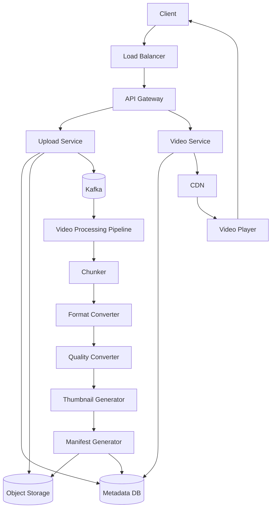

# YouTube High Level Design (HLD)

> This document contains interview notes for designing YouTube from scratch.
>
> **Scope**
>
> - Upload Videos
> - View / Stream Videos
>
> Other features such as comments, likes, recommendations, subscriptions, notifications and monetization are considered out of scope.

---

# 1. Functional Requirements

## 1. Upload Video

The system should allow users to upload videos.

During upload,

- Validate request
- Store video
- Store metadata
- Process video in background
- Generate multiple resolutions
- Generate thumbnails
- Generate streaming manifest

---

## 2. Stream Video

Users should be able to

- Watch videos
- Seek videos
- Resume playback
- Automatically switch quality depending upon internet speed
- Stream videos with very low latency

---

# 2. Non Functional Requirements

## High Availability

Users should be able to upload/watch videos even if few servers fail.

---

## Scalability

Millions of uploads and viewers should be supported.

The system should scale horizontally.

---

## Low Latency

Playback should start within a few seconds.

---

## Fault Tolerance

If one processing server crashes,

another worker should continue processing.

---

## Durability

Videos should never be lost.

Object Storage should replicate data.

---

# 3. Capacity Estimation

Since exact numbers are unavailable, let's make assumptions.

## Assumptions

| Metric | Value |
|---------|------|
| Daily Active Users | 100 Million |
| Uploads/day | 10 Million |
| Videos watched/user/day | 5 |
| Average Video Size | 100 MB |

---

## Upload Traffic

```
10 Million uploads/day

10,000,000 / 86400

≈116 uploads/sec

Peak ≈300 uploads/sec
```

---

## Streaming Traffic

```
100M users

×

5 videos/day

=

500 Million Views/day
```

```
500M / 86400

≈5800 requests/sec

Peak ≈25000 requests/sec
```

Observation

Read traffic is significantly higher than write traffic.

Hence YouTube is a **Read Heavy System**.

---

## Storage

Average Video

```
100 MB
```

Daily

```
10M ×100 MB

=

1 PB/day
```

Yearly

```
≈365 PB
```

A relational database cannot store this amount of binary data.

Hence we need Object Storage.

---

## Metadata

Metadata per video

```
≈2 KB
```

Daily metadata

```
10M ×2 KB

≈20 GB/day
```

Metadata is tiny compared to video storage.

Hence it can easily be stored inside a database.

---

# 4. API Design

## Upload Video

```
POST /videos
```

### Request

```json
{
    "title":"System Design",
    "description":"YouTube HLD",
    "file":"video.mp4"
}
```

> In production, the file is generally sent as **multipart/form-data** or uploaded directly to Object Storage using a pre-signed URL.

### Response

```json
{
   "videoId":"12345",
   "status":"PROCESSING"
}
```

Why PROCESSING?

Because uploading finishes quickly but transcoding can take several minutes.

The client should not wait.

---

## Get Video

```
GET /videos/{videoId}
```

Response

```json
{
   "videoId":"12345",
   "title":"System Design",
   "status":"READY",
   "duration":620,
   "thumbnailUrl":"...",
   "streamUrl":"https://cdn.youtube.com/master.m3u8"
}
```

Notice

We do NOT return the video.

Instead,

we return

```
Manifest URL
```

The player downloads video chunks directly from CDN.

---

# 5. High Level Architecture



---

# 6. Component Explanation

## Client

Represents

- Web Browser
- Android App
- iOS App
- Smart TV

Responsibilities

- Upload videos
- Stream videos

---

## Load Balancer

Distributes traffic across multiple API servers.

Benefits

- High Availability
- Scalability
- No Single Point of Failure

---

## API Gateway

Responsible for

- Authentication
- Authorization
- Routing
- Rate Limiting
- Logging

Every request enters through the API Gateway.

---

## Upload Service

Responsible for

- Validate upload
- Generate Video ID
- Save metadata
- Store original video
- Publish upload event

It **does not** perform transcoding.

Heavy processing happens asynchronously.

---

## Video Service

Provides

- Video metadata
- Manifest URL
- Thumbnail URL
- Video Status

It never streams video itself.

Instead,

it returns the CDN URL.

---

## Metadata Database

Stores

- Video ID
- Title
- Description
- Owner
- Upload Time
- Status
- Duration
- Manifest URL
- Thumbnail URL

Actual videos are **never stored here**.

---

## Object Storage

Stores

- Original Video
- Processed Videos
- Chunks
- Thumbnails

Examples

- Amazon S3
- Azure Blob Storage
- Google Cloud Storage

---

## Kafka

Purpose

Decouple Upload from Processing.

Without Kafka

```
Upload

↓

Transcoding

↓

Client waits
```

With Kafka

```
Upload

↓

Kafka

↓

Workers

↓

Client receives response immediately
```

---

## Video Processing Pipeline

Contains

- Chunker
- Format Converter
- Quality Converter
- Thumbnail Generator
- Manifest Generator

These workers consume Kafka events.

---

## CDN

Stores processed video chunks closer to users.

Instead of

```
India User

↓

US Server
```

Requests become

```
India User

↓

Nearest Edge Server
```

This significantly reduces latency.

---

# 7. Why This Architecture?

| Component | Reason |
|------------|--------|
| API Gateway | Authentication, Routing, Rate Limiting |
| Upload Service | Accept uploads and metadata |
| Metadata DB | Store video information |
| Object Storage | Store large binary files |
| Kafka | Asynchronous processing |
| Chunker | Enable adaptive streaming |
| Format Converter | Support multiple devices |
| Quality Converter | Support multiple resolutions |
| CDN | Low latency global streaming |

---

# End of Part 1

In **Part 2**, we'll cover:

- Upload Flow (Step-by-Step)
- Streaming Flow (Step-by-Step)
- Chunking Workflow
- Adaptive Bitrate Streaming
- Manifest Files (.m3u8)
- CDN Workflow
- Interview explanation for every step
