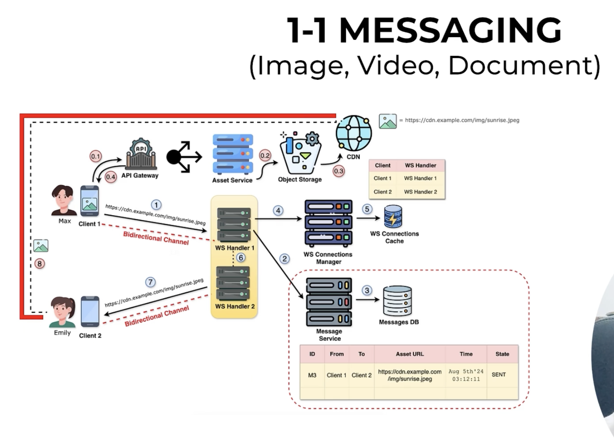

# WhatsApp High Level Design - 1:1 Media Messaging (Image, Video, Document)



# Why is media handled differently?

A text message is usually a few bytes or KB.

```
"Hi"
```

But an image or video can be:

- Image: 5 MB
- Video: 100 MB
- Document: 25 MB

Sending such files through WebSockets would:

- Block the connection
- Increase latency
- Reduce scalability

Therefore **WebSocket is only used to exchange metadata**, not the actual file.

---

# Components

## Client

The mobile app.

Responsible for:

- Uploading media
- Sending media URL
- Downloading media

---

## API Gateway

Receives upload requests.

Responsibilities:

- Authentication
- Authorization
- Rate limiting

It forwards upload requests to the Asset Service.

---

## Asset Service

Responsible for media uploads.

Responsibilities:

- Validate file
- Virus scan (optional)
- Compress/resize images
- Generate object key
- Upload to Object Storage

It never stores the file locally.

---

## Object Storage

Stores the original media.

Examples:

- Amazon S3
- Google Cloud Storage
- Azure Blob Storage

Example path

```
images/
   sunrise.jpg

videos/
   vacation.mp4
```

---

## CDN

Provides fast downloads.

Instead of downloading directly from Object Storage

```
Phone

↓

S3
```

users download from

```
Phone

↓

Nearest CDN Edge

↓

S3 (if needed)
```

This reduces latency dramatically.

Example URL

```
https://cdn.example.com/img/sunrise.jpg
```

---

## WebSocket Handler

Exactly the same handler used for text messages.

It does NOT transfer image bytes.

It only transfers

```
MessageId

Media URL

Sender

Receiver

Timestamp
```

---

## Message Service

Stores metadata only.

Database record

|Field|Value|
|-----|-----|
|From|Max|
|To|Emily|
|AssetURL|https://cdn.example.com/img/sunrise.jpg|
|Status|SENT|

Notice:

The actual image is NOT inside the database.

---

# End-to-End Flow

## Step 0.1 - Upload Request

Max selects an image.

Client sends HTTP upload request.

```
Client

↓

API Gateway

↓

Asset Service
```

HTTP is used because uploads are large.

---

## Step 0.2 - Store in Object Storage

Asset Service uploads the image.

```
Asset Service

↓

Object Storage
```

Example

```
images/sunrise.jpg
```

---

## Step 0.3 - Generate CDN URL

Object Storage returns an object path.

CDN exposes

```
https://cdn.example.com/img/sunrise.jpg
```

This URL is returned to the client.

---

## Step 0.4 - Upload Complete

Client now has

```
https://cdn.example.com/img/sunrise.jpg
```

No chat message has been sent yet.

---

## Step 1 - Send Chat Message

Client sends over existing WebSocket

```
{
 sender : Max,
 receiver : Emily,
 assetUrl : https://cdn.example.com/img/sunrise.jpg,
 type : IMAGE
}
```

Notice:

Only a few hundred bytes travel over WebSocket.

The image never travels through WebSocket.

---

## Step 2

WS Handler forwards metadata to Message Service.

---

## Step 3

Message Service stores

```
Sender

Receiver

Media URL

Timestamp

Status
```

---

## Step 4

Handler asks

```
Where is Emily?
```

---

## Step 5

Redis returns

```
Emily

↓

Handler 2
```

---

## Step 6

Message routed internally to Handler 2.

---

## Step 7

Handler 2 pushes metadata to Emily.

Emily receives

```
Image Available

↓

https://cdn.example.com/img/sunrise.jpg
```

Still no image bytes transferred.

---

## Step 8

Emily's phone downloads the image directly.

```
Emily Phone

↓

CDN

↓

Image
```

The chat server is NOT involved.

---

# Why use CDN?

Without CDN

```
India User

↓

US Object Storage
```

High latency.

With CDN

```
India User

↓

Mumbai CDN Edge
```

Much faster.

---

# Why not send images over WebSocket?

If a 100 MB video goes through the chat server:

```
Sender

↓

WS Handler

↓

Receiver
```

Problems:

- Huge memory usage
- Slow text messages
- Congested network
- Difficult scaling

Instead

```
Upload Once

↓

Object Storage

↓

Send URL

↓

Receiver Downloads
```

This is far more scalable.

---

# Text vs Media

|Text Message|Media Message|
|------------|-------------|
|Sent over WebSocket|Only metadata over WebSocket|
|Stored in Messages DB|Stored in Object Storage|
|Delivered immediately|Recipient downloads from CDN|
|Very small payload|Large payload handled separately|

---

# Interview Points

Mention:

- HTTP is used for uploads.
- WebSocket is used only for signalling.
- Object Storage stores binary files.
- Database stores only metadata.
- CDN serves media efficiently.
- Chat servers never stream large media files.

---

# Mental Model

Imagine sending a parcel.

Wrong approach:

```
Carry the parcel through the post office every time.
```

Correct approach:

```
Store parcel in a warehouse.

↓

Send warehouse address to friend.

↓

Friend collects parcel.
```

In WhatsApp:

- Warehouse = Object Storage
- Warehouse branches = CDN
- Address = Media URL
- Letter saying "parcel is ready" = WebSocket message

Remember this model and you'll always remember why media architecture is different from text messaging.
