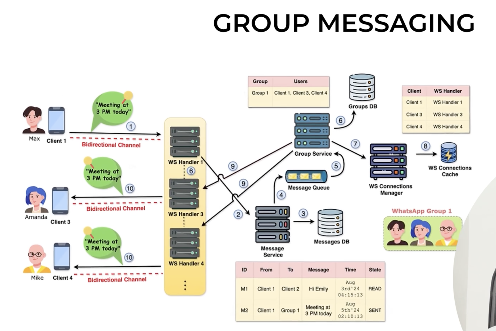

# WhatsApp HLD - Group Messaging




# Interview Question

**Design WhatsApp Group Messaging.**

---

# Core Idea

Group messaging is an extension of 1-to-1 messaging.

The only major difference is:

- **1-to-1:** Find one recipient.
- **Group:** Find all recipients and perform a **fan-out**.

---

# Functional Requirements

- Send messages to all group members.
- Exclude the sender from receiving another copy.
- Preserve message ordering.
- Support offline users.
- Scale to very large groups.

---

# High-Level Architecture

```
                 Sender
                    |
             WebSocket Handler
                    |
             Message Service
                    |
              Messages DB
                    |
              Kafka / Queue
                    |
              Group Service
               /          \
         Groups DB      Redis
                          |
                WS Connection Manager
                 /      |      \
            Handler3 Handler4 Handler5
               |        |        |
            Amanda    Mike     John
```

---

# Components

## Client
Maintains a WebSocket connection and sends the group message.

## WebSocket Handler
- Receives the message.
- Forwards it to the Message Service.
- Pushes outgoing messages to connected users.
- Contains no business logic.

## Message Service
Responsibilities:
- Validate request.
- Generate Message ID.
- Persist the message.
- Publish an event to Kafka (or another queue).

## Messages DB
Stores the message once.

Example:

| Field | Value |
|------|------|
| MessageId | M101 |
| GroupId | G1 |
| Sender | Max |
| Message | Meeting at 3 PM |
| Status | SENT |

## Kafka / Message Queue
Decouples message persistence from fan-out.

Instead of blocking while sending to thousands of members, the Message Service simply publishes an event and returns.

## Group Service
Responsibilities:
- Consume Kafka events.
- Find all members of the group.
- Exclude the sender.
- Ask Redis/Connection Manager where recipients are connected.
- Fan-out the message.

## Groups DB
Stores:

```
GroupId
   ↓
Members
```

Example:

```
G1

↓

Max
Amanda
Mike
John
```

## Redis / WS Connection Manager
Stores:

```
User

↓

Current WS Handler
```

Example:

```
Amanda → Handler3
Mike    → Handler4
John    → Handler5
```

---

# End-to-End Flow

## Step 1

Max sends:

```
Meeting at 3 PM
```

Message reaches Handler 1 over WebSocket.

---

## Step 2

Handler forwards it to the Message Service.

---

## Step 3

Message Service stores it in the Messages DB.

Notice:

The message is stored **once** with the Group ID.

---

## Step 4

Message Service publishes an event to Kafka.

Example:

```json
{
  "messageId":"M101",
  "groupId":"G1",
  "sender":"Max"
}
```

The service is now free to process the next request.

---

## Step 5

Group Service consumes the event.

---

## Step 6

Group Service queries the Groups DB.

```
Group G1

↓

Max
Amanda
Mike
John
```

---

## Step 7

Exclude the sender.

Recipients become:

```
Amanda
Mike
John
```

Then ask Redis / Connection Manager:

```
Where are these users connected?
```

---

## Step 8

Redis replies:

```
Amanda → Handler3
Mike    → Handler4
John    → Handler5
```

---

## Step 9

Group Service performs **Fan-Out**.

```
             Message

                |

      -------------------

      |        |        |

 Handler3 Handler4 Handler5
```

---

## Step 10

Each handler pushes the message over its existing WebSocket.

Amanda, Mike and John receive it instantly.

---

# What is Fan-Out?

One incoming message becomes many outgoing deliveries.

```
One Message

↓

Many Recipients
```

This is the key concept in group messaging.

---

# Why Kafka?

Imagine a group with 10,000 members.

Without Kafka:

```
Save

↓

Send 10,000 Messages

↓

Finish
```

The Message Service stays busy.

With Kafka:

```
Save

↓

Publish Event

↓

Done
```

Dedicated workers perform fan-out asynchronously.

---

# Offline Users

Suppose Mike is offline.

Redis returns:

```
Mike → Offline
```

The message is already stored in the database.

When Mike reconnects, pending messages are delivered.

---

# Message Ordering

Messages from the same group must remain ordered.

```
Hi

↓

Meeting

↓

Lunch

↓

Bye
```

A common approach is to partition Kafka by **Group ID** so all messages for the same group go to the same partition, preserving order.

---

# Production Improvement

Instead of storing one message per recipient:

## Message Table

|MessageId|GroupId|Sender|Message|
|---|---|---|---|
|M101|G1|Max|Meeting at 3 PM|

## Delivery Table

|MessageId|User|Status|
|---|---|---|
|M101|Amanda|DELIVERED|
|M101|Mike|READ|
|M101|John|SENT|

This avoids duplicating message content while allowing per-user delivery and read tracking.

---

# Interview Answer

"The sender sends the message over WebSocket to the WebSocket Handler. The handler forwards it to the Message Service, which persists the message and publishes a Kafka event. The Group Service consumes the event, retrieves group members from the Groups DB, excludes the sender, looks up each recipient's handler using Redis, and performs a fan-out by sending the message to every recipient's WebSocket Handler. Each handler pushes the message to its connected client. Offline users receive the message after reconnecting."

---

# Key Interview Points

- Group messaging extends 1-to-1 messaging.
- Store the message once.
- Use Kafka for asynchronous fan-out.
- Use Groups DB to resolve members.
- Exclude the sender.
- Use Redis for User → Handler lookup.
- Fan-out to recipient handlers.
- Preserve ordering using Group ID partitioning.
- Track delivery/read status per member.
