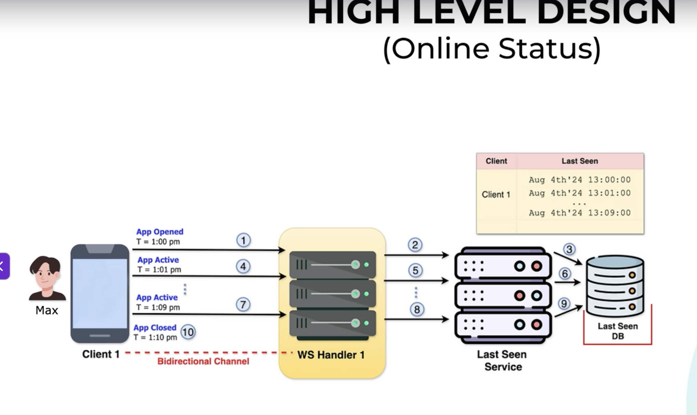

# WhatsApp HLD - Online Status / Last Seen



## Interview Notes

### Meaning of Online
- Online means the WhatsApp app is open and active (foreground), not merely that the phone has internet.

### Architecture
```
Client
  |
WebSocket
  |
WS Handler
  |
Last Seen Service
 / \
Redis  Last Seen DB
```

### Components
- Client: Opens WebSocket and sends periodic presence pings.
- WS Handler: Receives pings and forwards them. No business logic.
- Last Seen Service: Updates presence and last-seen information.
- Redis: Stores current online status and latest activity for fast lookups.
- Last Seen DB: Stores persistent last-seen timestamps.

### Flow
1. User opens app.
2. Presence ping is sent over the existing WebSocket.
3. WS Handler forwards it to Last Seen Service.
4. Last Seen Service updates Redis (or DB in a simplified design).
5. Every minute while the app remains active, another presence ping updates the latest activity timestamp.
6. When the app closes or pings stop, the most recent timestamp becomes the user's Last Seen.

### Presence Ping vs WebSocket Ping
- Presence Ping: Application-level message indicating the user is active.
- WebSocket Ping/Pong: Protocol-level keepalive used to detect broken connections.

### Scalability Improvement
Instead of updating the database every minute:
1. Update Redis with every presence ping.
2. Persist to the database only when the user goes offline.

### Interview Answer
"The client maintains a persistent WebSocket connection. While the app is active, it periodically sends lightweight presence pings. The WebSocket Handler forwards them to the Last Seen Service, which updates the user's latest activity. In production, Redis typically stores current presence, while the database stores the final last-seen timestamp when the user goes offline."

### Mental Model
Office attendance system:
- Badge scan = Presence Ping
- Security Guard = Last Seen Service
- Attendance board = Redis
- Attendance register = Last Seen DB
