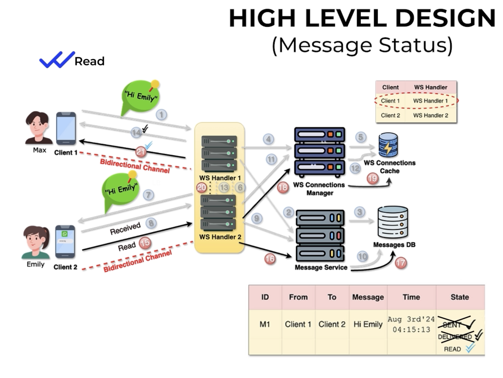

# WhatsApp High Level Design - Message Status (Sent ✓, Delivered ✓✓, Read ✓✓ Blue)



## Introduction

One of the most common interview questions is:

> How does WhatsApp know whether a message is **Sent**, **Delivered**, or **Read**?

The answer is that these are **state transitions**. Every transition is sent back as a small acknowledgement (ACK) over the existing WebSocket connection.

---

# Message States

```
Client sends message
        │
        ▼
 SENT (✓)
        │
Recipient device receives
        ▼
DELIVERED (✓✓)
        │
Recipient opens chat
        ▼
READ (Blue ✓✓)
```

Only metadata (message id + new status) is exchanged.

---

# Components

## Client

The mobile application.

Responsibilities:

- Send messages
- Send Delivered ACK
- Send Read ACK
- Update UI

---

## WebSocket Handler

Maintains the persistent socket.

It transports:

- Chat messages
- Delivery acknowledgements
- Read acknowledgements

No business logic lives here.

---

## Message Service

Responsible for:

- Updating status
- Persisting status changes
- Routing ACKs back to sender

---

## Messages DB

Example

|MessageId|Status|
|---|---|
|M1|SENT|
|M1|DELIVERED|
|M1|READ|

In practice this is an update of the same record (or an append-only event log).

---

## Connection Cache (Redis)

Maps

```
User -> Chat Server / Handler
```

so ACKs can be routed to the correct sender.

---

# End-to-End Flow

The diagram combines three flows.

## Flow 1 - Sender sends message (Steps 1-6)

1. Max sends "Hi Emily" over WebSocket.
2. WS Handler forwards it to Message Service.
3. Message Service stores the message with status **SENT**.
4. Handler asks Connection Manager where Emily is connected.
5. Connection Manager checks Redis.
6. Message is routed to Emily's handler.

At this point Max sees:

```
✓ Sent
```

Meaning:

> "The server has accepted and stored my message."

---

## Flow 2 - Delivered (Steps 7-14)

7. Emily's handler pushes the message to Emily's phone.
8. Emily's phone successfully receives it.
9. Emily's client immediately sends a **Delivered ACK**.

Example:

```json
{
  "messageId":"M1",
  "status":"DELIVERED"
}
```

10. ACK reaches Message Service.
11. Database status is updated to DELIVERED.
12. Connection Manager finds Max's handler.
13. ACK is routed to Max's handler.
14. Max's phone updates the UI.

Now Max sees:

```
✓✓
```

Meaning:

> "Emily's device received the message."

This does **not** mean Emily has opened it.

---

## Flow 3 - Read (Steps 15-21)

15. Emily opens the conversation.

The client sends:

```json
{
  "messageId":"M1",
  "status":"READ"
}
```

16. Handler forwards READ ACK.
17. Database status becomes READ.
18. Connection Manager locates Max.
19. Redis returns Max's handler.
20. READ ACK is routed to Max's handler.
21. Max's client updates UI.

Now Max sees:

```
Blue ✓✓
```

Meaning:

> Emily actually opened the chat and the message was marked as read.

---

# Why ACKs are tiny

Notice that the original message is **never resent**.

Only this travels:

```json
{
  "messageId":"M1",
  "status":"READ"
}
```

This keeps bandwidth extremely low.

---

# Offline Scenario

Suppose Emily is offline.

```
Max

↓

Server

↓

Database
```

Status stays:

```
SENT
```

When Emily reconnects:

```
Pending Messages

↓

Emily receives

↓

Delivered ACK

↓

Read ACK (later)
```

The sender eventually sees the status updates.

---

# Database Example

|ID|From|To|Message|Status|
|---|---|---|---|---|
|M1|Max|Emily|Hi Emily|READ|

Status progression:

```
SENT

↓

DELIVERED

↓

READ
```

---

# Interview Tips

Mention these points:

- Sent means the server accepted and persisted the message.
- Delivered means the recipient device acknowledged receipt.
- Read means the recipient application acknowledged that the user viewed it.
- ACKs are tiny metadata packets sent over the existing WebSocket.
- Status updates are persisted to survive reconnects.

---

# Mental Model

Imagine sending a courier.

1. Courier company receives the parcel → **Sent**.
2. Parcel reaches your friend's house → **Delivered**.
3. Your friend opens the parcel → **Read**.

WhatsApp works exactly the same way, except the confirmations are small ACK messages over WebSockets.
